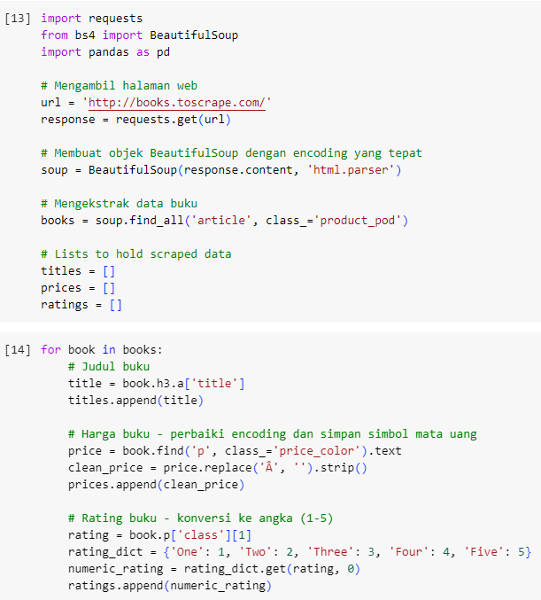
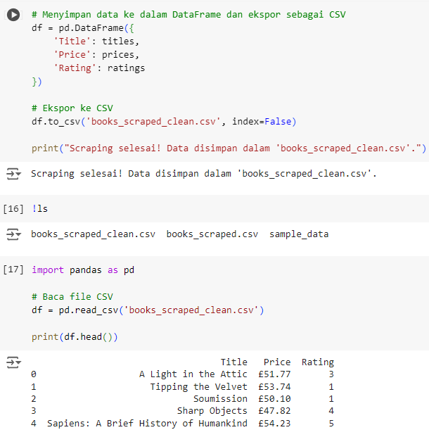
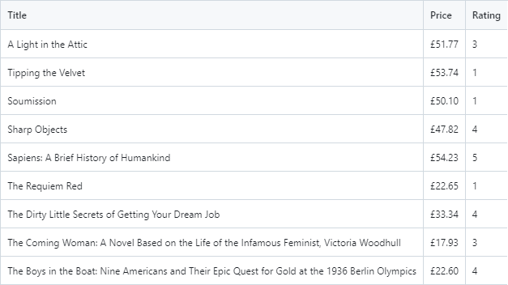
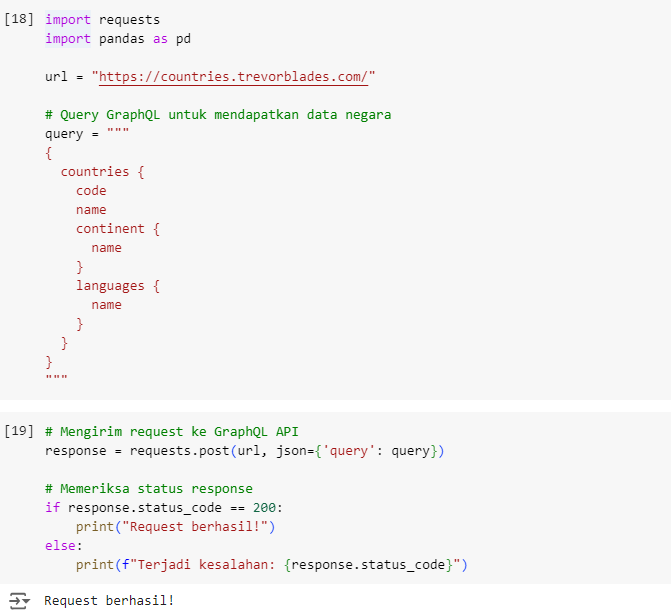
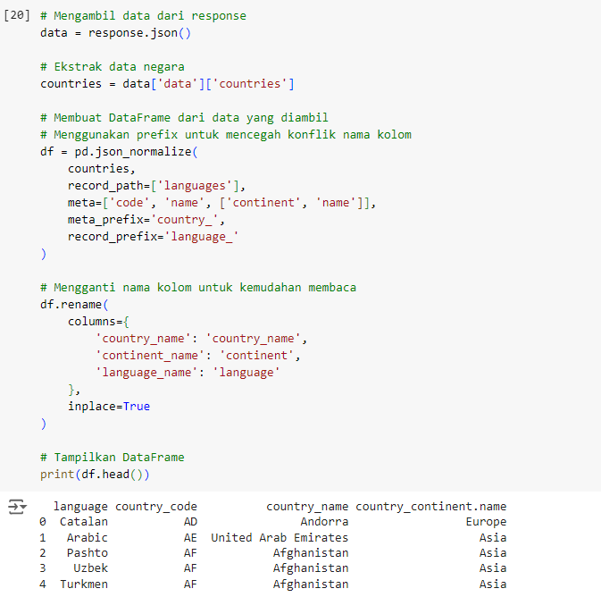
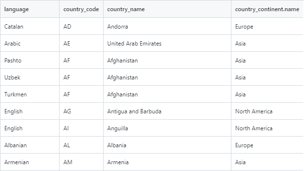

# Web Scraping & GraphQL Assignment

## Description

This project aims to perform web scraping from the [Books to Scrape](http://books.toscrape.com/) website to extract book data, and use the GraphQL API to access country data from the [Countries GraphQL API](https://countries.trevorblades.com/). This project was developed as part of a data engineering bootcamp assignment and serves as my portfolio in the field of data engineering.

## Technologies Used

- **Python**: For implementing web scraping and GraphQL.
- **Libraries**:
  - `requests`: For fetching web pages and APIs.
  - `BeautifulSoup`: For parsing HTML and extracting data from the website.
  - `pandas`: For processing and storing data in CSV format.
- **Google Colab**: As the environment to run the Python code.
- **GitHub**: For version control and storage of the results.

## Repository Structure

- `Abil_Farabil - Web_scraping - GraphQL - Assignment.ipynb`: Notebook containing the Python code for web scraping and using the GraphQL API. [Link to Notebook](Abil_Farabil_Web_scraping_GraphQL_Assignment.ipynb)
- `books_scraped_clean.csv`: CSV file containing the scraped book data with columns `Title`, `Price`, and `Rating`. [Link to CSV](data/books_scraped_clean.csv)
- `countries_data.csv`: CSV file containing the country data retrieved from the GraphQL API, with columns `Code`, `Name`, `Continent`, and `Language`. [Link to CSV](data/countries_data.csv)

## Steps

### 1. Extracting Book Data from Books to Scrape
   - **Process**: Fetching web pages using `requests.get`, parsing HTML with `BeautifulSoup`, and extracting book data.
   - **Output**: Displaying a few sample rows of the scraped data, which is saved in the `books_scraped_clean.csv` file.

   
   

### 2. Book Data Results
   - **Description**: The scraped book data is saved in a CSV format with columns `Title`, `Price`, and `Rating`.
   
   

### 3. Retrieving Country Data Using GraphQL
   - **Process**: Using the [Countries GraphQL API](https://countries.trevorblades.com/) to fetch country data, including code, continent, and language.
   - **Output**: Displaying the GraphQL query results, which are processed into a DataFrame.

   
   

### 4. Country Data Results
   - **Description**: The GraphQL query results are saved in a CSV format with columns `Code`, `Name`, `Continent`, and `Language`.

   

## Conclusion

The scraping process successfully extracted book data from the [Books to Scrape](http://books.toscrape.com/) website and retrieved country data using the GraphQL API from the [Countries GraphQL API](https://countries.trevorblades.com/). The obtained results are accurate and ready for further analysis. This project demonstrates my ability to use various techniques to access and process data from different sources, as well as document the results professionally on GitHub.

## References

- [Books to Scrape](http://books.toscrape.com/): Source of the book scraping data.
- [Countries GraphQL API](https://countries.trevorblades.com/): Source of the country data through GraphQL.
- [BeautifulSoup Documentation](https://www.crummy.com/software/BeautifulSoup/bs4/doc/): Guide for using BeautifulSoup.
- [Requests Documentation](https://docs.python-requests.org/en/latest/): Guide for using the requests library.
- [GraphQL Documentation](https://graphql.org/learn/): Basic guide for using GraphQL.
